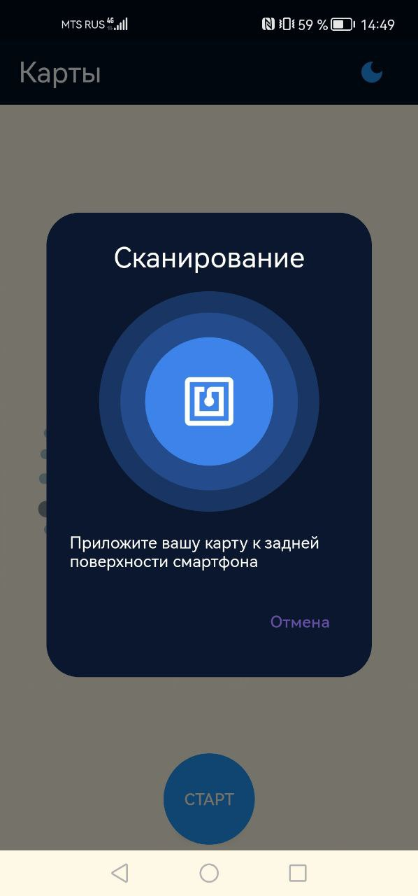
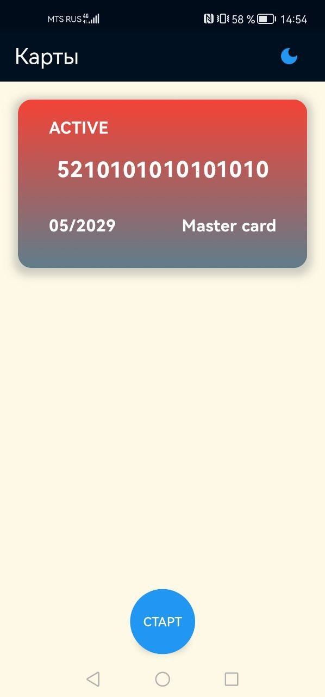
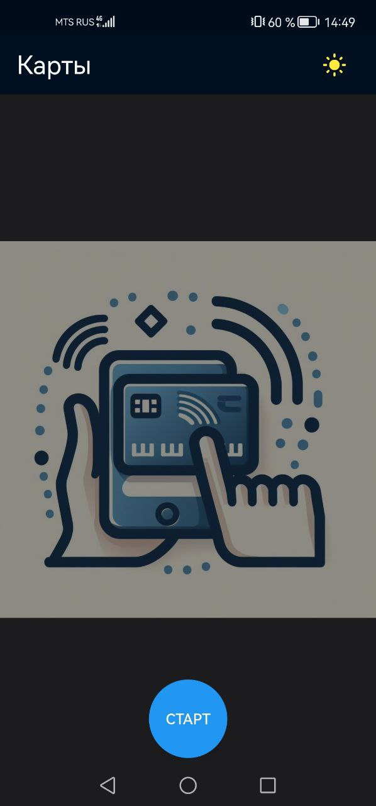
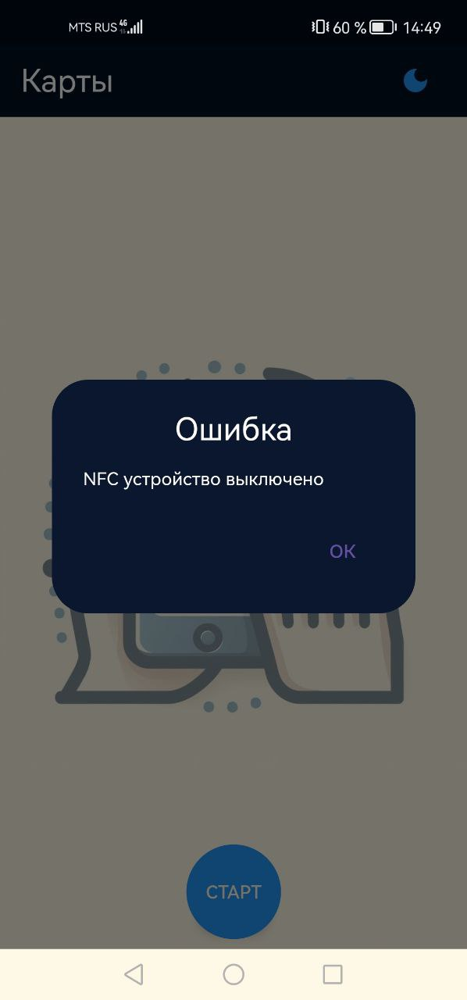
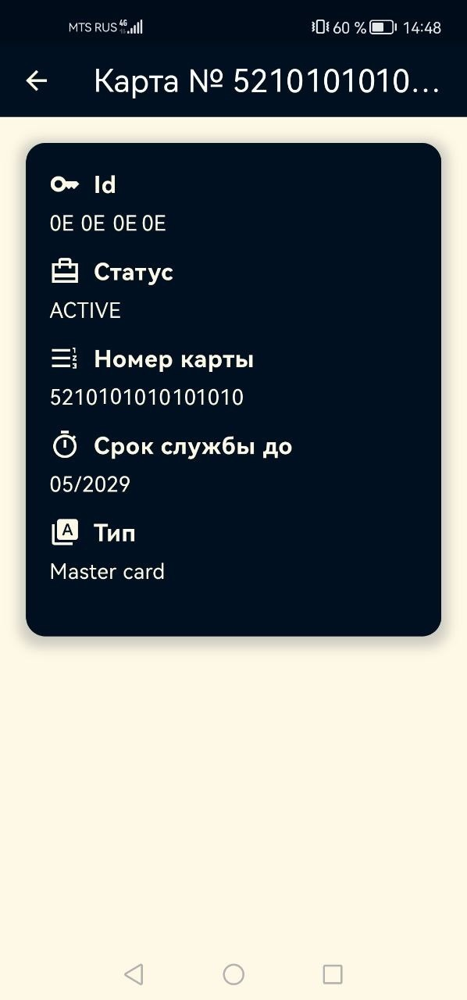

# NFC Card Reader

NFC Card Reader - это приложение на платформе Flutter, позволяющее легко и безопасно считывать информацию с кредитных и дебетовых банковских карт с использованием технологии NFC.

   

  
   
   
  	
  
   
  
  

   
  
## Версии SDK и пакетов

- Flutter: **3.16.3**
- Dart: **3.2.3**
- provider: **^6.1.1**
- sqflite: **^2.3.0**
- flutter_slidable: **^3.0.1**
- shared_preferences: **^2.2.2**
- json_annotation: **^4.8.1**
- json_serializable: **^6.7.1**
- build_runner: **^2.3.3**
- nfc_manager:
    git:
      url: https://github.com/WolverRu/nfc_manager.git
      ref: main

 ## Изученные материалы

 - [Flutter и работа с нативным кодом на примере библиотеки для работы с NFC](https://habr.com/ru/articles/770842/)
  

## Приложение доступно в Google Play

